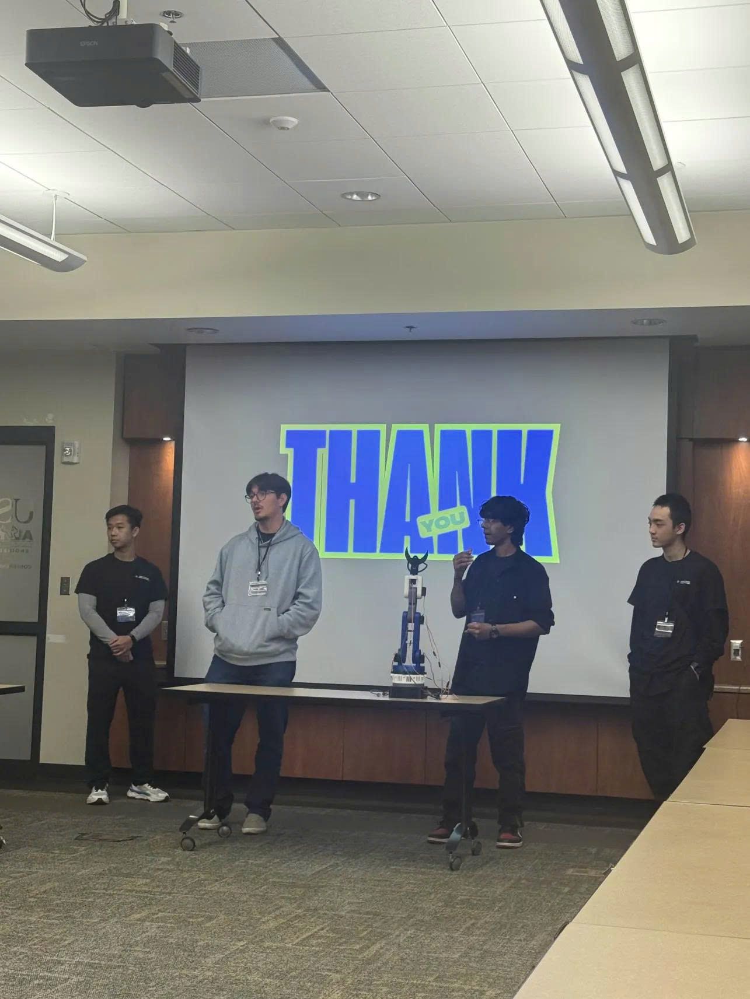

# Fall-2025-ACM-Project-Hub
## Project Hub Overview

For this project hub, we built a gesture controlled robotic arm, which tracks your hand using your computer's camera and commands the arm to move accordingly. In this project, we used many technologies including computer vision/machine learning, inverse kinematics, Arduino programming, and a bit of 3D printing, CAD design, and circuit design.

This project was designed to help students learn by doing. Instead of traditional workshops, our role is to guide you as you collaborate through Discord and GitHub. Additionally, by working on this project together, you’ll also gain hands-on experience in coding, teamwork, and making documentation.

Our end goal is to showcase the project in a final event where you can present your work, since it’s about building a project that demonstrates your skills and looks great on your resume, boosting your internship chances and paving the way for future Project Hubs. This year we got the opportunity to present at the ACM AI Convention 2026, the flagship event hosted by the ACM chapter at USF (University of South Florida). This is where many startups, companies, research labs, and student organizations around Tampa will come and showcase their best projects (and for some, job openings as well) utilizing AI to spark further interest and discussion about AI.



## How It Works
At a high level, the logic follows like this:
1. The camera from your computer tracks your hand, specifically your pinky finger, using a ML/CV model and uses your neck as the reference to determine the finger's relative coordinates. It also measures the distance between the thumb and index finger to determine whether or not the claw/gripper should be opened.
2. After a few seconds (modifiable within the code), the camera will record the coordinates and freezes for some time, which means it is telling the robotic arm to move accordingly.
3. The recorded coordinates will be passed through an inverse kinematics function, which would basically tell the Arduino which motors to rotate and rotate by how much to reach that position in the real world.
4. Once the recorded coordinates data have been passed through the inverse kinematics function, it is sent to Arduino through Serial connection. The Arduino receives them and control the motors, rotating each exact ones by the exact amount to move the robotic arm to match the user's (you) hand position.
5. Due to certain physical limitations (which will be explained more within the code), the arm will take some time to move to its designated position, thus resulting in the occasional frame freezes above. The logic for opening and closing the claw/gripper follows similarly, but with a lower wait time and no delay.

## How To Build And Run The Robotic Arm
Step 1: Get all the necessary items to build the arm from here: [Budget list](https://docs.google.com/spreadsheets/d/1uxJGKECmyGAl8QNd6KDAllocNuYVkL5isB1ABSVi34I/edit?usp=sharing). Remember to check out each item's functionality before you begin assembling.

Step 2: 3D print the robotic arm (expect a lot of things to break so prepare lots of spare materials for printing):
- [Gripper](https://www.thingiverse.com/thing:1748596)
- [Base](https://www.thingiverse.com/thing:1750025)
- [Arm](https://www.thingiverse.com/thing:1838120)

Step 3: Assemble the arm following the instructions given in the Thingiverse links in step 2. You can use glue to fix the elbow and wrist 1 joints in place as there currently doesn't seem to have any screws to fix it in place. You can also choose to fix the base in place by installing 5 screws down to a platform (like a wooden board) to position the arm in 1 place, however if you choose not to do so (like we did) note that you'll have to hold the arm's base with something to stop it from falling over.

Step 4: Run a simple Arduino sketch (that you can write yourself or pull a sample one online) to test out each motor's rotate range and (optionally) manually change them to make the arm move within your desired range. For this step you can use the 5V battery pack for the servos, but for the stepper motor you have to connect it to the A4988, set the Vref to a suitable number ([Tutorial here](https://www.youtube.com/watch?v=OpaUwWouyE0)), before supplying power to it using a 11.1V LiPo battery.

Step 5: Once you're done testing, assemble the circuit according to this [Tutorial here](https://smartbuilds.io/diy-robot-arm-arduino-hand-gestures/). To power all 6 servos at once, you must use a 11.1V LiPo battery with the UBEC (in the budget list) in between.

Step 6: Open an IDE of your choice (e.g. VS Code) and setup a Python virtual environment and install the necessary libraries/packages using ```pip install -r requirements.txt```. Test if all motors are working fine using the code from ```slider.py```.

Step 7: Open JupyterLab (through Anaconda Navigator for example) and install the necessary libraries/packages again using ```!conda env create -f environment.yml``` (run inside a Jupyter Cell). Afterwards test if inverse kinematics is working properly using the code from ```Test_Inverse_Kinematics.ipynb```. If you need further help this [Tutorial](https://www.youtube.com/watch?v=XDSzbJAwJKA) can help.

Step 8: Once you've confirmed that the inverse kinematics code works properly, run the ```Actual_Inverse_Kinematics.ipynb``` code to test whether the arm moves correctly as well. The Arduino code is already given so check it out if you want. If for some reason the dimensions of your arm and/or the rotate range of the joints is different, update the ```actual_arm_urdf.urdf``` file and the corresponding code as well. Note that the ```Actual_Inverse_Kinematics.py``` file is there simply to eliminate the need to open JupyterLab all the time to run the code.

Step 9: Now that the hardware portion is done, time to move on to the software portion. First test out the tracking model in test.py to see if it's accurately tracking your hand and returning the desired coordinates. Optionally change the delay between each recording of the arm's coordinates and/or claw tracking to your liking.

Step 10: Finally, run the complete program using the code from ```Complete_arm_control_code.py``` and congrats! You now have a robotic arm that moves according to your hand and can open/close the gripper from your hand gestures.

## How To Run The Software
1. Connect the Arduino to your computer via USB cable. Then, open the ```/Software``` folder and open the ```Complete_arm_control_code.py``` file, which is the code of our robotic arm operation.
2. Run ```pip install -r requirements.txt``` in the terminal. This will install every library needed for the complete operation of the robot listed in the ```requirements.txt``` file.
3. Now to start the operation of the robotic arm, you can run the ```Complete_arm_control_code.py``` file. When it launches, two instructions will appear on the top of the camera frame: "MOVE HAND FAR" and "MOVE HAND CLOSE". This is the calibration stage of the software. So when prompted, move your hand as far away from the camera you can without moving your shoulder excessively, same thing with close to the camera. After that, "CALIBRATION DONE" should appear on the screen. If it is felt that the calibration wasn't done correctly, it is recommended to close and run the software again by pressing ```q``` on your keyboard.
4. With the software calibrated, the arm should be operational if correctly set up: The code works by moving the robotic arm to the user's hand position relative to their shoulder. Also, by tracking if the index and thumb fingers of the user are touching the software defines the claw as open or closed.
5. The software takes some time to move the robot, and it freezes every time it is happening so the robot has its needed time to move. In case the freezes are too frequent or too spaced away, modify lines 223 and 226 PLOT_EVERY_N and PLOT_EVERY_N_CLAW.

## Contributions

**Minh - Hardware Lead** <br />
https://github.com/CodingMinh <br />
- Created a comprehensive budget list to successfully receive funding for the project.
- Assembled the entire robotic arm with the help of Long - Hardware Shadow.
- Implemented inverse kinematics to control the robotic arm more easily.
- Programmed the Arduino to receive inverse kinematics input and control the robotic arm smoothly and responsively.
- Assisted Gabriel - Software Lead in bridging hand-tracking (CV/ML) with inverse kinematics to enable seamless hardware-software synchronization for the robotic arm control.

**Viet - Software Shadow** <br />
- Developed the main codebase for ```hand-wrist-elbow-track.py``` integrating MediaPipe tracking with coordinate display system.
- Created ```robot_arm_visualizer.py``` as a testing utility for validating robot arm positions.
- Optimized coordinate display panels with color-coded information (red/blue for jaws, cyan for distance) and improved layout to avoid blocking camera view.
- Fixed one critical bug in axis mapping where MediaPipe's y axis and z axis were the opposite to the robot's space coordinates, causing inverted arm movement.
- Minor code clean up.

## TODO
- Slow down the arm/make the arm move around smoother to prevent accidental breaking from sudden impact when moving long distances.
- Find a better alternative to the NEMA-17 stepper motor (preferably a servo) to allow for immediate and correct rotation of the arm. Or optimize the code/math to account for the center of gravity's change so that the stepper rotates to the correct angle.
- (Optional) For long term use upgrade the motors and 3D printed materials.
- Improve the CV/ML code to track depth better.